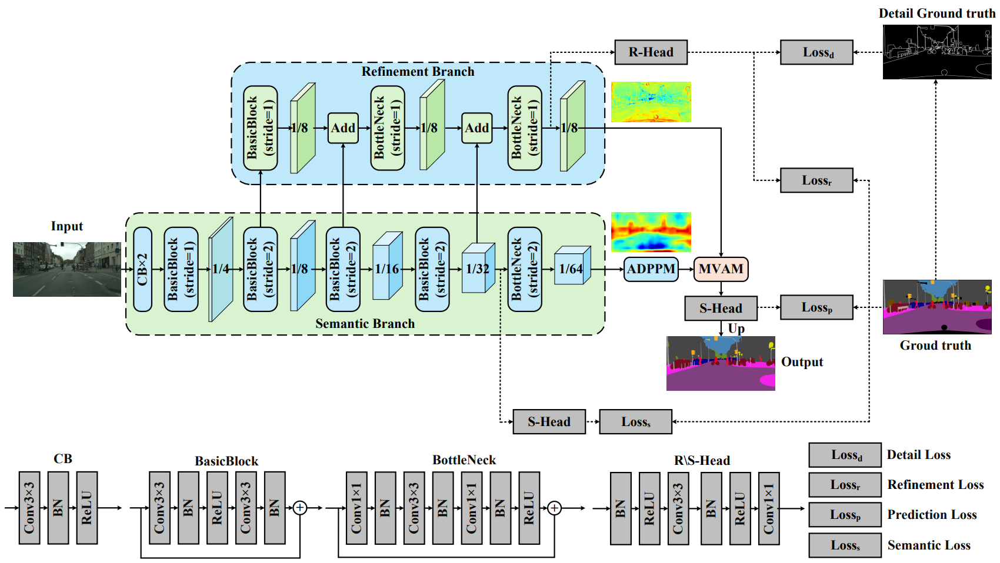
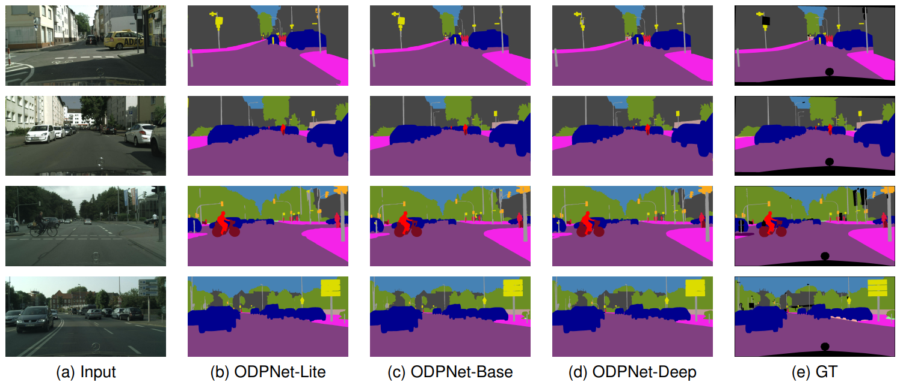
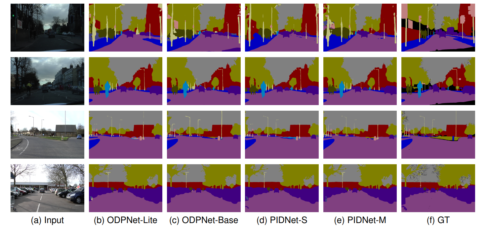

# ODPNet: Orthogonal Dual-Path Network for Real-Time Semantic Segmentation of Urban Road Scenes

[](https://opensource.org/licenses/MIT)

## Introduction

ODPNet is a real-time semantic segmentation network designed for urban road scene understanding.


## Overview

Balancing segmentation accuracy with inference speed remains a formidable challenge in real-time autonomous driving scenarios. Existing approaches often suffer from the receptive field rigidity of conventional square pooling and the inherent distribution misalignment between semantic and spatial features.

To address these limitations, we propose the **Orthogonal Dual-Path Network (ODPNet)**. Specifically, we introduce the **Atrous Decoupled Pyramid Pooling Module (ADPPM)** to overcome the redundancy of standard pooling operations. Furthermore, to effectively bridge the gap between high-level semantics and fine-grained details, we propose the **Multi-View Aggregation Module (MVAM)**. Utilizing trans-dimensional attention, MVAM harmonizes the heterogeneous representations, ensuring precise feature recalibration.

## Datasets

### Setup Instructions

1. Download the [Cityscapes](https://www.cityscapes-dataset.com/) and [CamVid](http://mi.eng.cam.ac.uk/research/projects/VideoRec/CamVid/) datasets.
2. Unzip them into the following directories:
   - `data/cityscapes`
   - `data/camvid`
3. Verify that the paths in `data/list` match your dataset image locations.

## Results

### Cityscapes Dataset

| Method | Pretrain | Val (% mIOU) | Test (% mIOU) | FPS (torch) |
|:---:|:---:|:---:|:---:|:---:|
| **ODPNet-Lite** | No | 77.6 | 77.4 | 162.1 |
| **ODPNet-Base** | No | 78.4 | 78.3 | 64.2 |
| **ODPNet-Deep** | No | 78.9 | 78.8 | 48.2 |
| **ODPNet-Lite** | ImageNet | **78.9** | **78.7** | **162.1** |
| **ODPNet-Base** | ImageNet | 79.9 | 79.8 | 64.2 |
| **ODPNet-Deep** | ImageNet | 80.4 | 80.3 | 48.2 |

### CamVid Dataset

| Method | Pretrain | Val (% mIOU) | Test (% mIOU) | FPS (torch) |
|:---:|:---:|:---:|:---:|:---:|
| **ODPNet-Lite** | No | - | 72.9 | 208.4 |
| **ODPNet-Base** | No | - | 74.6 | 152.5 |
| **ODPNet-Lite** | Cityscapes | - | 80.4 | 208.4 |
| **ODPNet-Base** | Cityscapes | - | 82.2 | 152.5 |

## Visualizations

We provide qualitative visualization results to demonstrate the superior performance of **ODPNet** in complex urban driving scenarios.
### Cityscapes Results


### CamVid Results


## Key Features

- **Multiple Model Variants**: Lite, Base, and Deep versions to balance accuracy and speed.
- **Real-time Inference**: High-speed processing for practical applications.

## Installation

```bash
# Install dependencies
pip install -r requirements.txt


