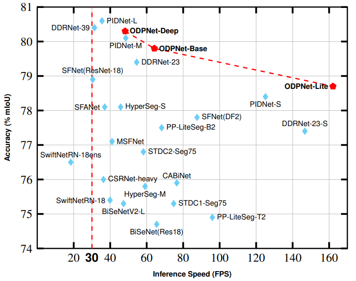

# DCGNet: Decoupled Context and Detail-Guided Network for Real-Time Semantic Segmentation of Urban Road Scenes

## Introduction

DCGNet is a real-time semantic segmentation network designed for urban road scene understanding. It adopts a decoupled dual-branch architecture that separately processes context and detail information, enabling efficient and accurate segmentation results.



## Overvie

## Datasets

### Setup Instructions

1. Download the [Cityscapes](https://www.cityscapes-dataset.com/) and [CamVid](http://mi.eng.cam.ac.uk/research/projects/VideoRec/CamVid/) datasets
2. Unzip them into the following directories:
   - `data/cityscapes`
   - `data/camvid`
3. Verify that the paths in `data/list` match your dataset image locations

## Results

### Cityscapes Dataset

| Method | Pretrain | Val (% mIOU) | Test (% mIOU) | FPS(torch) |
|:-------|:---------|:-------------|:--------------|:-----------|
| DCGNet-Lite | No | 77.6 | 77.4 | 162.1 |
| DCGNet-Base | No | 78.4 | 78.3 | 64.2 |
| DCGNet-Deep | No | 78.9 | 78.8 | 48.2 |
| DCGNet-Lite | ImageNet | 78.9 | 78.7 | 162.1 |
| DCGNet-Base | ImageNet | 79.9 | 79.8 | 64.2 |
| DCGNet-Deep | ImageNet | 80.4 | 80.3 | 48.2 |

### CamVid Dataset

| Method | Pretrain | Val (% mIOU) | Test (% mIOU) | FPS(torch) |
|:-------|:---------|:-------------|:--------------|:-----------|
| DCGNet-Lite | No | - | - | - |
| DCGNet-Base | No | - | - | - |
| DCGNet-Lite | Cityscapes | - | - | - |
| DCGNet-Base | Cityscapes | - | - | - |

## Key Features

- **Multiple Model Variants**: Lite, Base, and Deep versions to balance accuracy and speed
- **Real-time Inference**: High-speed processing for practical applications
- **Transfer Learning**: Support for ImageNet and Cityscapes pretraining

## Installation

```bash
# Clone the repository
git clone [https://github.com/yourusername/dcgnet.git](https://github.com/yourusername/dcgnet.git)
cd dcgnet

# Install dependencies
pip install -r requirements.txt
